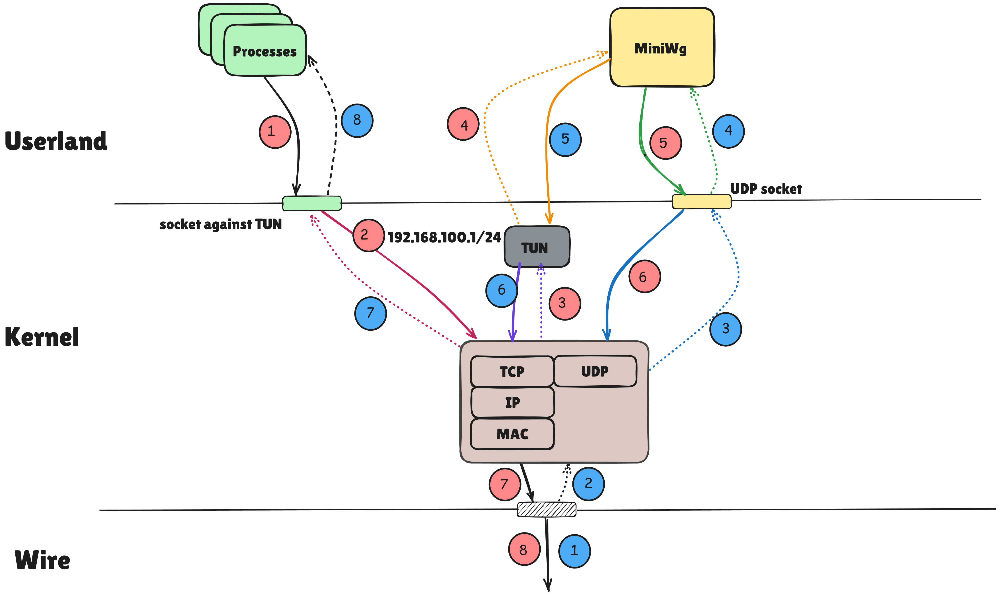
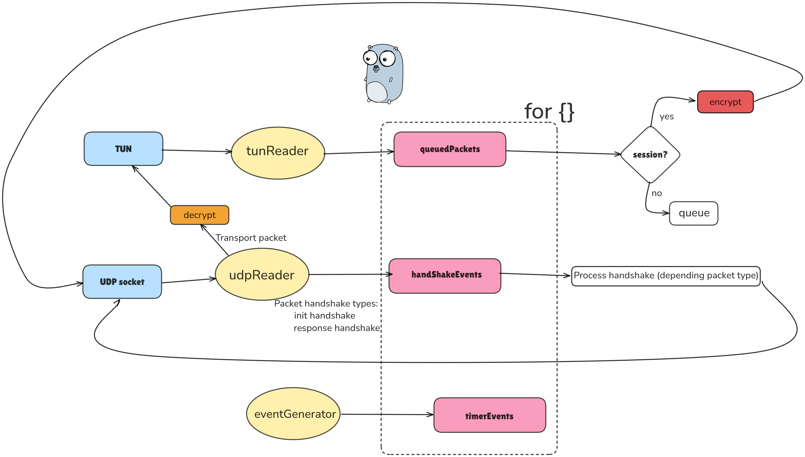

# MiniWG: Educational WireGuard Implementation

A minimal, educational WireGuard implementation for learning cryptography and
networking protocols.

**Warning:** This is an educational implementation. Use official WireGuard for production.

## Overview

WireGuard is a modern VPN protocol that uses state-of-the-art cryptography.
This implementation focuses on clarity and learning rather than performance or
feature completeness.

## Implementation Architecture

MiniWG implements the core WireGuard components with a focus on educational clarity:

## Milestones Achieved

✅ **Milestone 1**: Two MiniWG peers communicate successfully

✅ **Milestone 2**: MiniWG interoperates with official WireGuard

## Features Implemented

TODO...

## Quick Start

TODO...

## Learning Resources

TODO ...

### External References

- [WireGuard Whitepaper](docs/wireguard.pdf) - Original protocol specification
- [WireGuard-Go Implementation](https://github.com/WireGuard/wireguard-go) - Official reference implementation
- [Noise Protocol Framework](http://noiseprotocol.org/) - Cryptographic framework used by WireGuard

## Missing Features

TODO...

## Acknowledgments

- [Jason](https://www.zx2c4.com) for writing such an incredible piece of software.
- [Noise Protocol Framework](http://noiseprotocol.org/) for the cryptographic foundation.
- [Jason](https://www.zx2c4.com) (and contributors) for the fantastic [golang implementation](https://github.com/WireGuard/wireguard-go).
